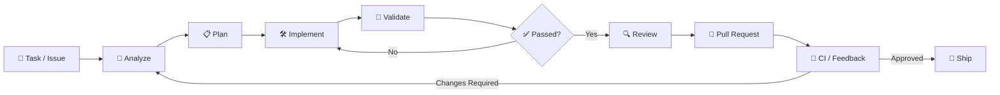

<div align="center">

# ⚡ Runloop

### 🤖 Autonomous Software Engineering System

**Turn engineering tasks into executable workflows. Plan, implement, validate, review, and ship.**

<br>

[](LICENSE)
[](https://www.python.org/)
[](https://github.com/langchain-ai/langgraph)

</div>

---

## 🚀 Overview

**Runloop** is an autonomous software engineering platform designed to turn high-level development tasks into complete, executable workflows.

Give Runloop a task and it can:

* 🧠 Analyze the repository and understand the task
* 📋 Plan the required implementation
* 🛠️ Modify and generate code
* 🧪 Run tests and validation
* 🔍 Review implementation changes
* 🔄 Iterate based on failures and feedback
* 📦 Commit and prepare changes
* 🔀 Create and update pull requests
* 👀 Monitor CI and development workflows

Instead of stopping at code generation, Runloop focuses on the complete **engineering loop** from task to validated delivery.

---

## 🔁 Engineering Loop



---

## ✨ Core Capabilities

### 🧠 Autonomous Development

Runloop investigates the existing codebase before making changes, builds an implementation plan, modifies the relevant files, and validates the result.

### 🔬 Repository-Aware Reasoning

The system works with the repository's existing structure, conventions, instructions, dependencies, and development workflow rather than treating every task as an isolated coding problem.

### 🧪 Validation & Iteration

Changes are tested and validated inside an isolated execution environment. Failures can feed back into the workflow for another implementation cycle.

### 🔍 Code Review

Runloop can perform read-only reviews of pull requests and surface findings grounded in the actual diff and repository context.

### 🔄 Continuous Engineering

Development does not have to end when the first PR is created. Follow-up tasks, review feedback, CI failures, and additional changes can continue through the same workflow.

### 🧩 Extensible Architecture

The system is designed around modular agents, tools, skills, execution environments, integrations, and workflow components.

---

## 🏗️ Architecture

```text
                    ┌─────────────────────┐
                    │     Task / Issue     │
                    └──────────┬──────────┘
                               │
                               ▼
                    ┌─────────────────────┐
                    │   Planning Engine   │
                    └──────────┬──────────┘
                               │
                               ▼
              ┌────────────────────────────────┐
              │       Engineering Agent        │
              │                                │
              │  • Repository Analysis         │
              │  • Code Changes                │
              │  • Shell / Tools               │
              │  • Subagents                   │
              │  • Validation                  │
              └───────────────┬────────────────┘
                              │
                              ▼
                    ┌─────────────────────┐
                    │   Isolated Sandbox  │
                    └──────────┬──────────┘
                               │
                               ▼
                    ┌─────────────────────┐
                    │   Tests / CI / QA   │
                    └──────────┬──────────┘
                               │
                               ▼
                    ┌─────────────────────┐
                    │     Code Review     │
                    └──────────┬──────────┘
                               │
                               ▼
                    ┌─────────────────────┐
                    │    Pull Request     │
                    └─────────────────────┘
```

---

## 🧱 Workflow Components

| Component    | Responsibility                                         |
| ------------ | ------------------------------------------------------ |
| 🧠 Planner   | Understands the task and creates an execution strategy |
| 🤖 Engineer  | Implements repository changes                          |
| 🔬 Analyzer  | Investigates repository structure and conventions      |
| 🔍 Reviewer  | Performs pull-request analysis                         |
| 💬 Chat      | Answers questions about changes and PRs                |
| ⏱️ Scheduler | Executes recurring engineering workflows               |
| 🧪 Validator | Runs tests and checks implementation correctness       |
| 📦 Delivery  | Commits changes and prepares pull requests             |

---

## 🛠️ Technology

Runloop is designed around an agentic software-engineering architecture with:

* 🐍 Python
* 🕸️ LangGraph
* 🤖 Deep Agents
* 🔧 Tool-based agent execution
* 🧪 Automated validation
* 📦 Isolated development sandboxes
* 🔀 Git-based workflows
* 🌐 API-driven integrations

---

## 🎯 Example Workflow

```text
User:
"Add authentication to the API and write tests."

        ↓

Runloop
        ↓
Analyzes repository
        ↓
Identifies API architecture
        ↓
Creates implementation plan
        ↓
Modifies authentication layer
        ↓
Adds tests
        ↓
Runs validation
        ↓
Fixes failures
        ↓
Reviews changes
        ↓
Creates Pull Request
        ↓
Monitors CI
```

---

## 🔐 Safety & Isolation

Autonomous engineering requires controlled execution.

Runloop is designed to support:

* 🔒 Isolated execution environments
* 🛡️ Repository access boundaries
* 🔑 Controlled credentials
* 👤 Human approval workflows
* 👀 Read-only review modes
* 📋 Planning before implementation
* 🚦 Configurable automation policies

Deployments should follow least-privilege principles and restrict repository, credential, and integration access appropriately.

---

## 📁 Project Structure

```text
runloop/
├── agent/
│   ├── agents/
│   ├── tools/
│   ├── workflows/
│   └── ...
├── frontend/
├── tests/
├── docs/
├── scripts/
├── pyproject.toml
└── README.md
```

---

## ⚙️ Getting Started

### Clone

```bash
git clone https://github.com/ATLURI0001/runloop.git
cd runloop
```

### Environment

```bash
uv venv
source .venv/bin/activate
```

Windows:

```powershell
.venv\Scripts\Activate.ps1
```

### Install

```bash
uv sync --all-extras
```

### Run

```bash
make dev
```

The development server will start locally.

---

## 🧪 Development

Run tests with:

```bash
pytest
```

Build the frontend with:

```bash
make build-dashboard
```

Run the development environment with:

```bash
make dev
```

---

## 🗺️ Roadmap

* [x] Repository analysis
* [x] Autonomous code modification
* [x] Task planning
* [x] Validation workflows
* [x] Pull-request workflows
* [ ] Advanced multi-agent orchestration
* [ ] Expanded repository integrations
* [ ] Improved autonomous debugging
* [ ] Enhanced CI recovery
* [ ] Workflow observability
* [ ] Additional sandbox providers

---

## 🤝 Contributing

Contributions are welcome.

```bash
git checkout -b feature/your-feature
git commit -m "feat: add your feature"
git push origin feature/your-feature
```

Then open a pull request.

---

## 📄 License

This project is licensed under the **MIT License**.

---

<div align="center">

### ⚡ Runloop

**Understand → Plan → Build → Validate → Review → Ship**

</div>
